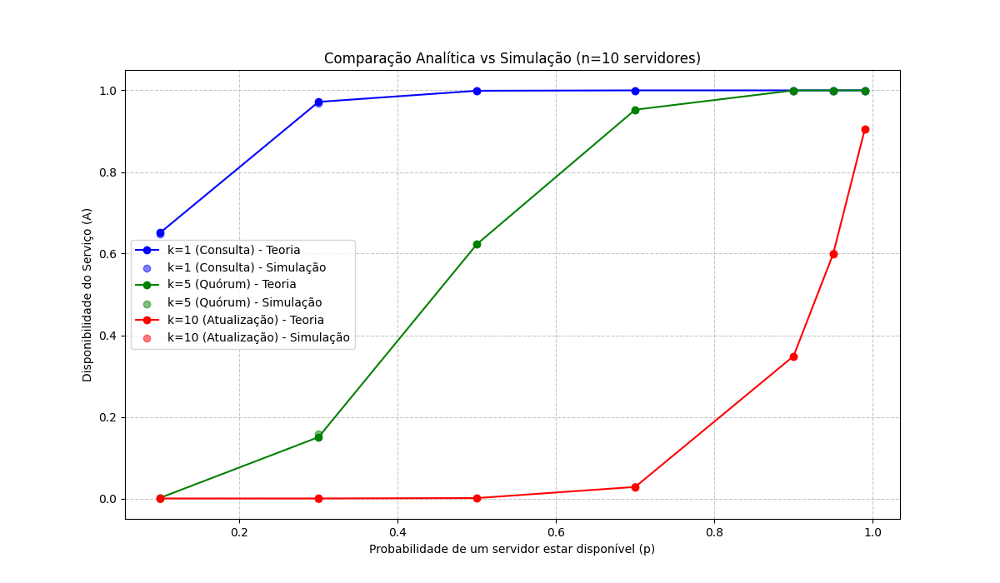

# Relatório de Sistemas Distribuídos

## Identificação do Grupo
* **Luiz Henrique Ribeiro** - Matrícula: 2520528
* **Leonardo Silva Ferreira** - Matrícula: Matrícula
* **Ravi Freitas** - Matrícula: 2316154
* **Luca Solon** - Matrícula: 1910486

---

## 1. Exercício 1.1: Dedução e Análise Analítica

### Fórmula de Disponibilidade
A disponibilidade do serviço ($A$) em um sistema distribuído com $n$ servidores redundantes, onde cada um possui probabilidade $p$ de estar ativo, e o quórum mínimo para operação é $k$, é dada pela somatória da distribuição binomial:

$$A(n, k, p) = \sum_{i=k}^{n} \binom{n}{i} \cdot p^i \cdot (1 - p)^{n-i}$$

### Comentários sobre a fórmula:
* **Termo $\binom{n}{i}$:** Representa as diferentes combinações de quais servidores específicos podem estar ativos.
* **Termo $p^i$:** É a probabilidade de $i$ servidores estarem funcionando simultaneamente.
* **Termo $(1-p)^{n-i}$:** É a probabilidade de os servidores restantes estarem em falha.
* **A Somatória:** Acumula todas as situações em que o sistema está operacional (desde o mínimo $k$ até o máximo $n$).

### Dados Analisados (Exemplo $n=10$)
* **Cenário $k=1$ (Leitura/Consulta):** Alta tolerância a falhas. O sistema só cai se todos os 10 servidores falharem. A disponibilidade tende a 1 rapidamente mesmo com $p$ baixo.
* **Cenário $k=n$ (Escrita/Consistência Forte):** Baixa tolerância. Se um único servidor falhar, o serviço fica indisponível. A disponibilidade é $p^{10}$.

---

## 2. Exercício 1.2: Simulação Estocástica vs. Modelo Analítico

Nesta etapa, validamos a teoria através de um simulador de Monte Carlo.

### Metodologia da Simulação
O simulador executa **10.000 rodadas** para cada configuração. Em cada rodada:
1. Gera-se um estado para cada servidor usando um gerador de números aleatórios ($random \le p$).
2. Conta-se quantos servidores ficaram "Online".
3. Verifica-se se a contagem atingiu o quórum $k$.
4. A **Frequência Experimental** é a razão entre rodadas bem-sucedidas e o total de rodadas.

### Tabela de Resultados (Exemplo de Saída)

| $p$ (Prob. Indiv.) | $k$ (Quórum) | $A$ (Analítico) | $A$ (Simulado) | Erro Absoluto |
| :--- | :--- | :--- | :--- | :--- |
| 0.90 | 1 | 0.999999 | 1.000000 | 0.000001 |
| 0.90 | 5 | 0.998365 | 0.998200 | 0.000165 |
| 0.90 | 10 | 0.348678 | 0.349100 | 0.000422 |

### Gráfico Comentado
O gráfico abaixo correlaciona a probabilidade individual ($p$) com a disponibilidade total ($A$).

### Análise dos Gráficos
* **Aproximação:** As curvas teóricas (linhas) e os pontos experimentais (círculos) sobrepõem-se quase perfeitamente, provando que o modelo matemático binomial descreve com precisão o comportamento real de sistemas distribuídos.
* **Divergência:** Pequenas variações ocorrem apenas devido à natureza estocástica da simulação, tendendo a zero conforme o número de rodadas aumenta.
* **Conclusão Prática:** Para sistemas que exigem alta disponibilidade, deve-se manter $k$ baixo em relação a $n$. Para sistemas que exigem consistência estrita ($k=n$), a infraestrutura individual de cada nó deve ser de altíssima confiabilidade, pois a falha é multiplicativa.
